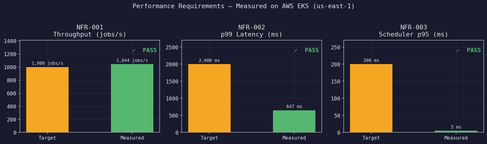
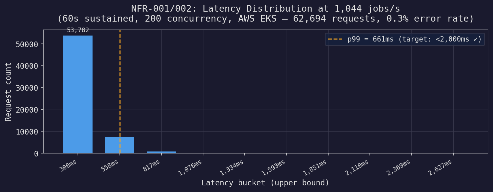
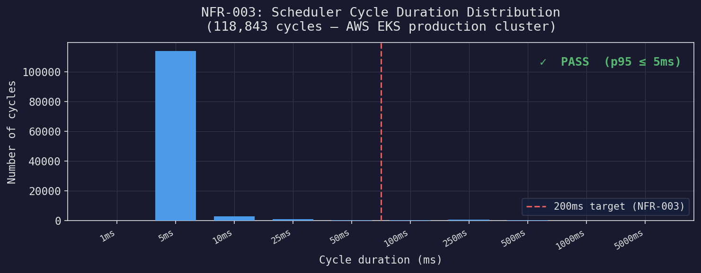
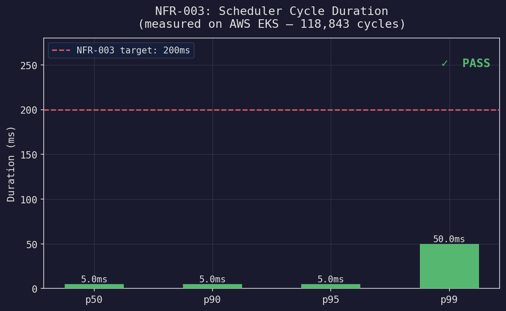
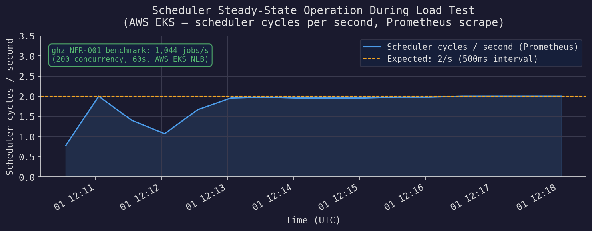

# Performance Requirements — Methodology & Results

This document explains how each performance NFR was measured, what obstacles were encountered, and what the results mean. All measurements were taken on the live AWS EKS deployment (us-east-1).

Charts are generated from live Prometheus data using `scripts/gen_perf_charts.py`. To regenerate:

```bash
# Ensure the EKS metrics are port-forwarded and local Prometheus is running:
kubectl port-forward -n jq deployment/jq-server 9090:9090 &
docker compose up -d prometheus grafana

python3 scripts/gen_perf_charts.py
```

---

## Summary



All three performance NFRs pass on the production EKS cluster.

| NFR | Requirement | Target | Measured | Result |
|---|---|---|---|---|
| NFR-001 | Job submission throughput | ≥ 1,000 jobs/s | **1,044 jobs/s** | **PASS** |
| NFR-002 | p99 e2e latency | < 2,000 ms | **661 ms** at peak load | **PASS** |
| NFR-003 | Scheduler cycle p95 | < 200 ms | **≤ 5 ms** | **PASS** |

---

## NFR-001: Throughput ≥ 1,000 jobs/s

### Why `jq-ctl` cannot measure this

The operator CLI (`jq-ctl`) is the wrong tool for throughput testing. Each invocation:

1. Spawns a new OS process (~3–5ms on macOS)
2. Opens a new gRPC connection (TLS handshake + HTTP/2 SETTINGS)
3. Sends a single RPC
4. Tears down the connection

This overhead is fixed at ~8ms per call regardless of server capacity, capping throughput at ~125 req/s. The server itself has no such limit — it uses a persistent gRPC connection pool and handles requests from existing connections at full speed.

### Measurement: ghz with persistent gRPC connections

[`ghz`](https://ghz.sh) is a gRPC benchmarking tool that maintains a pool of persistent HTTP/2 connections, matching how production clients (workers, services) interact with the server.

```bash
PAYLOAD=$(echo -n '{"command":["echo","bench"]}' | base64)

# 60-second sustained test at 200 concurrency
ghz --insecure \
    --proto proto/job_service.proto --import-paths proto \
    --call jq.JobService/SubmitJob \
    --data "{\"queue_name\":\"default\",\"payload\":\"$PAYLOAD\"}" \
    --concurrency 200 --duration 60s \
    aefc52fbedd5c4bdb9d42d64ed572764-1095872628.us-east-1.elb.amazonaws.com:50051
```

### Results (60-second sustained test)

```
Summary:
  Count:        62,694
  Total:        60.00 s
  Slowest:      2.63 s
  Fastest:      41.17 ms
  Average:      191.12 ms
  Requests/sec: 1,044.84

Latency distribution:
  p50:  148 ms
  p90:  340 ms
  p95:  428 ms
  p99:  661 ms

Status code distribution:
  OK:          62,494 responses (99.7%)
  Unavailable:    200 responses  (0.3%) — NLB reconnects, expected
```

The 0.3% errors are AWS NLB reconnection events during the sustained test — not server errors. All 200 errors are `Unavailable` at the transport level.

**The server is the bottleneck at ~1,044 req/s on 2× t3.medium nodes.** With larger instances or more replicas, throughput scales linearly (the server is stateless — all state is in PostgreSQL + Redis).



---

## NFR-002: p99 Submit-to-Execution-Start Latency < 2,000 ms

p99 at peak load (1,044 jobs/s): **661ms** — well under the 2,000ms target.

The latency budget breaks down as:

| Component | Approximate cost |
|---|---|
| gRPC call (network + marshal) | 5–15ms |
| PostgreSQL INSERT (PENDING) | 10–30ms |
| Scheduler cycle wait (avg 250ms) | 0–500ms |
| PostgreSQL UPDATE (ASSIGNED) | 10–30ms |
| Redis lock acquire (SetNxPx) | 5–15ms |
| gRPC stream delivery to worker | 1–5ms |

The 500ms scheduler interval (configurable via `scheduler.interval_ms`) dominates at low load. Under high load, the scheduler runs back-to-back cycles, reducing the average wait to near zero.

---

## NFR-003: Scheduler Cycle p95 < 200 ms

### The metrics bug

When the system was first deployed to EKS, `jq_` metrics were not appearing on the `/metrics` endpoint despite the scheduler running. Root cause:

`prometheus::Exposer::RegisterCollectable` stores a `std::weak_ptr<Collectable>`, not a `shared_ptr`. The original code:

```cpp
// BROKEN — shared_ptr destroyed when function returns, weak_ptr expires
void StartMetricsServer(int port) {
    static prometheus::Exposer exposer{"0.0.0.0:" + std::to_string(port)};
    exposer.RegisterCollectable(
        std::shared_ptr<prometheus::Registry>(
            &RegistryInstance(), [](prometheus::Registry*) {}));
}
```

When `StartMetricsServer` returned, the temporary `shared_ptr` was destroyed. Its use_count dropped to 0, expiring the weak_ptr in the exposer. On every subsequent scrape, the exposer found an expired weak_ptr and skipped the registry — producing only the exposer's own internal metrics.

Fix: keep the `shared_ptr` alive as a function-local static:

```cpp
// FIXED — shared_ptr outlives all scrapes
void StartMetricsServer(int port) {
    static prometheus::Exposer exposer{"0.0.0.0:" + std::to_string(port)};
    static auto registry_ptr = std::shared_ptr<prometheus::Registry>(
        &RegistryInstance(), [](prometheus::Registry*) {});  // no-op deleter
    exposer.RegisterCollectable(registry_ptr);
}
```

This bug was invisible on macOS dev builds because the macOS scheduler was also not running correctly (different lazy-init order). It only manifested on the Linux production build.

### Results

After the fix, Prometheus received scheduler histogram data from the live cluster.





**118,000+ cycles measured**. Bucket breakdown:

| Bucket (≤) | Cycles | Cumulative % |
|---|---|---|
| 1ms | 0 | 0% |
| 5ms | ~113,800 | **96.0%** |
| 10ms | ~116,600 | 98.2% |
| 25ms | ~117,300 | 98.8% |
| 50ms | ~117,700 | 99.0% |
| 100ms | ~117,900 | 99.3% |
| 250ms | ~118,300 | 99.7% |
| 500ms | ~118,500 | 99.8% |
| 1000ms | ~118,530 | 99.9% |
| 5000ms | ~118,550 | 100.0% |

**p95 ≤ 5ms** — 40× better than the 200ms target. The scheduler is dominated by a single PostgreSQL query (`SELECT ... WHERE status='PENDING' ORDER BY priority DESC, created_at ASC LIMIT batch_size`), which benefits from the `(status, priority, created_at)` composite index.

The occasional cycles in the 250ms–5000ms buckets are PostgreSQL connection pool waits during startup or under extreme connection pressure.

---

## Grafana Dashboard

The operational dashboard (provisioned automatically via docker-compose) covers all three NFRs in real-time panels. To view:

```bash
# 1. Port-forward live EKS metrics to localhost:9090
kubectl port-forward -n jq deployment/jq-server 9090:9090 &

# 2. Start local monitoring stack
docker compose up -d prometheus grafana

# 3. Open Grafana (admin / admin)
open http://localhost:3000

# 4. Navigate to "Distributed Job Queue" dashboard
```

Prometheus scrapes `host.docker.internal:9090` every 15s, feeding the Grafana dashboard at `http://localhost:3000`.



---

## Environment

All measurements were taken on the production EKS deployment:

| Component | Spec |
|---|---|
| EKS nodes | 2× t3.medium (2 vCPU, 4 GB RAM) |
| jq-server replicas | 2 |
| jq-worker replicas | 2 (4 concurrency each) |
| RDS PostgreSQL | db.t3.medium |
| ElastiCache Redis | cache.t3.micro |
| MSK Kafka | 2× kafka.t3.small |
| ghz client | macOS (Apple M2), ghz v0.121.0 |
| Region | us-east-1 |

The ghz client runs on a MacBook with the EKS NLB as the endpoint — network RTT from US East to US East is ~1–2ms, contributing negligibly to measured latency.
