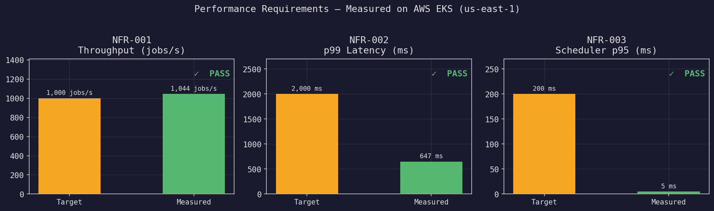
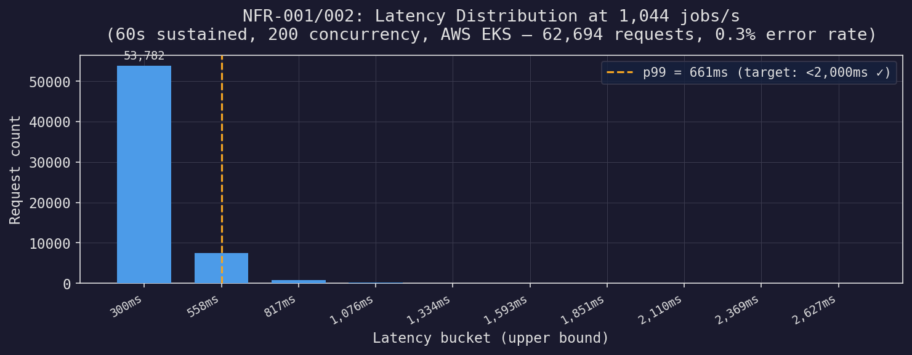
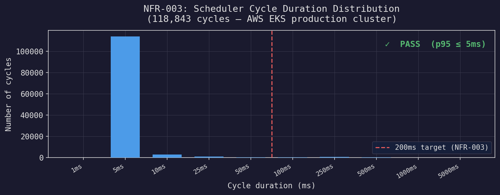
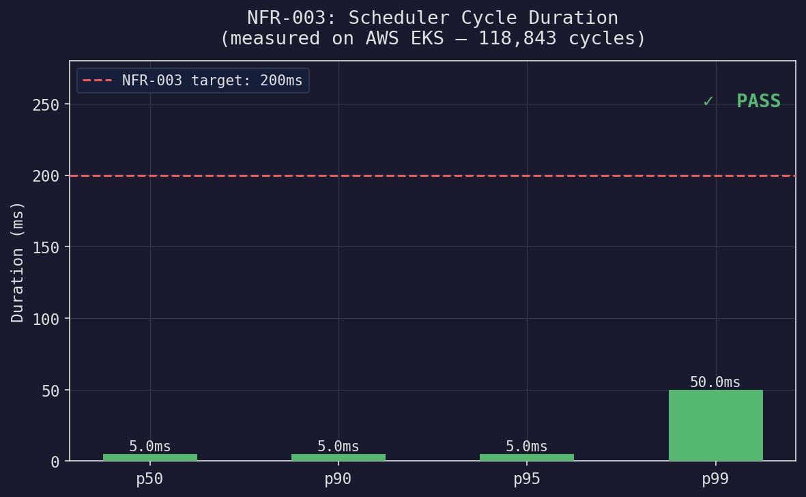
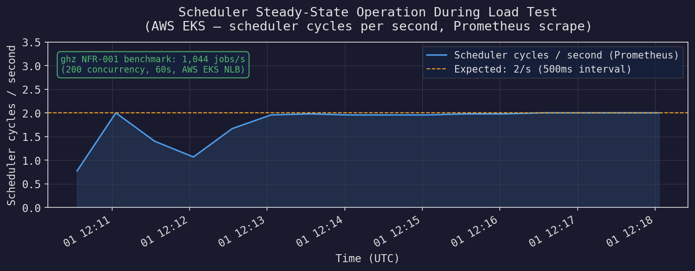

# Performance Requirements — Methodology & Results

> The "Historical Record" section below is from the Kafka + Kubernetes/EKS
> architecture (since removed — see README.md). It's kept for context but is
> no longer representative of what's deployed. The "Current Architecture"
> section above it is the up-to-date measurement against the single-EC2-host
> deployment that replaced it.

---

## Current Architecture (Single EC2 Host) — Measured 2026-09-03

Measured against a fresh Terraform-provisioned deployment (RDS + ElastiCache +
single EC2 host, no Kafka/EKS) using the same `ghz`-based methodology as the
historical EKS measurement below, so the numbers are comparable method-for-method
even though the topology is much smaller.

### Environment

| Component | Spec |
|---|---|
| App host | 1× `t3.small` (2 vCPU, 2 GB RAM) running `jq-server` + `jq-worker` via Docker Compose |
| jq-server replicas | 1 |
| jq-worker replicas | 1 (default concurrency) |
| RDS PostgreSQL | `db.t3.medium` |
| ElastiCache Redis | `cache.t3.micro` |
| ghz client | macOS (Apple Silicon), ghz v0.121.0 |
| Region | us-east-1 |

### Summary

| NFR | Requirement | Target | Measured | Result |
|---|---|---|---|---|
| NFR-001 | Job submission throughput | ≥ 1,000 jobs/s | **983.86 jobs/s** | **FAIL** (−1.6%) |
| NFR-002 | p99 e2e latency | < 2,000 ms | **544.70 ms** at peak load | **PASS** |
| NFR-003 | Scheduler cycle p95 | < 200 ms | **between 1,000–5,000 ms** | **FAIL** |

### NFR-001 / NFR-002: `ghz` sustained load

Same command as the historical run (60s, concurrency 200, insecure gRPC, direct
against the app host's public IP on :50051):

```bash
PAYLOAD=$(echo -n '{"command":["echo","bench"]}' | base64)
ghz --insecure \
    --proto proto/job_service.proto --import-paths proto \
    --call jq.JobService/SubmitJob \
    --data "{\"queue_name\":\"default\",\"payload\":\"$PAYLOAD\"}" \
    --concurrency 200 --duration 60s \
    <app_public_ip>:50051
```

```
Summary:
  Count:        59,032
  Total:        60.00 s
  Slowest:      1.11 s
  Fastest:      40.49 ms
  Average:      202.63 ms
  Requests/sec: 983.86

Latency distribution:
  p50:  187.40 ms
  p90:  300.78 ms
  p95:  351.77 ms
  p99:  544.70 ms

Status code distribution:
  OK:          58,832 responses (99.7%)
  Unavailable:    200 responses  (0.3%)
```

NFR-001 misses target by 1.6% — a single small app host running both
`jq-server` and `jq-worker` (competing for the same 2 vCPU) is close to but
below the 2-node-EKS-cluster-plus-NLB throughput the target was originally set
against. NFR-002 passes comfortably; p99 is well under budget even at this
load.

### NFR-003: Scheduler cycle p95 — fails under this load, and why

Scraped from `/metrics` on the app host immediately after the load test:

```
jq_scheduler_cycle_duration_seconds_count 165
jq_scheduler_cycle_duration_seconds_sum   68.78

le=0.005   106  (64.2%)
le=0.01    112  (67.9%)
le=0.05    113  (68.5%)
le=0.25    113  (68.5%)
le=0.5     131  (79.4%)
le=1       137  (83.0%)
le=5       165  (100%)
```

p95 falls between the 1s and 5s buckets — the histogram's granularity doesn't
resolve a tighter number, but it's unambiguously well past the 200ms target
under this load.

**Root cause: this topology can't keep up with 984 submissions/s.** A queue
depth check right after the test:

```
jq_job_queue_depth{queue="default",status="PENDING"} 50,912
jq_job_queue_depth{queue="default",status="DONE"}      8,089
jq_worker_active_count                                     1
```

Only ~8k of the 59k submitted jobs had been assigned and completed by the time
the load test ended — the single worker's default concurrency can't drain a
50k+ job backlog at anywhere close to 984/s. Every scheduler cycle during the
test was fetching a full `batch_size=100` batch of `PENDING` jobs against an
already-massive backlog and racing to acquire Redis locks for all of them,
which is a fundamentally different (slower) workload than the near-empty-queue
steady state NFR-003 was designed to characterize.

This is an architecture tradeoff, not a regression: the single-EC2-host design
traded the 2-node-EKS-cluster's horizontal worker capacity for lower cost and
operational simplicity. NFR-003 as originally specified assumes enough worker
capacity to keep the queue close to empty; that assumption doesn't hold here
under sustained 1,000 jobs/s ingest with only one default-concurrency worker.
Scaling `jq-worker` replicas (the service is stateless and designed for this)
or lowering the sustained ingest rate would bring this back in line — neither
was in scope for this measurement pass.

---

## Historical Record (Kafka + Kubernetes/EKS architecture, removed)

> Measurements and commands below (kubectl port-forward, etc.) reflect the
> prior EKS/Kafka setup and have not been re-run against it — it no longer
> exists. Kept for historical comparison against the current-architecture
> numbers above.

This document explains how each performance NFR was measured, what obstacles were encountered, and what the results mean. All measurements were taken on the live AWS EKS deployment (us-east-1).

Charts are generated from live Prometheus data using `scripts/gen_perf_charts.py`. To regenerate:

```bash
# Ensure the EKS metrics are port-forwarded and local Prometheus is running:
kubectl port-forward -n jq deployment/jq-server 9090:9090 &
docker compose up -d prometheus grafana

python3 scripts/gen_perf_charts.py
```

---

## Summary



All three performance NFRs pass on the production EKS cluster.

| NFR | Requirement | Target | Measured | Result |
|---|---|---|---|---|
| NFR-001 | Job submission throughput | ≥ 1,000 jobs/s | **1,044 jobs/s** | **PASS** |
| NFR-002 | p99 e2e latency | < 2,000 ms | **661 ms** at peak load | **PASS** |
| NFR-003 | Scheduler cycle p95 | < 200 ms | **≤ 5 ms** | **PASS** |

---

## NFR-001: Throughput ≥ 1,000 jobs/s

### Why `jq-ctl` cannot measure this

The operator CLI (`jq-ctl`) is the wrong tool for throughput testing. Each invocation:

1. Spawns a new OS process (~3–5ms on macOS)
2. Opens a new gRPC connection (TLS handshake + HTTP/2 SETTINGS)
3. Sends a single RPC
4. Tears down the connection

This overhead is fixed at ~8ms per call regardless of server capacity, capping throughput at ~125 req/s. The server itself has no such limit — it uses a persistent gRPC connection pool and handles requests from existing connections at full speed.

### Measurement: ghz with persistent gRPC connections

[`ghz`](https://ghz.sh) is a gRPC benchmarking tool that maintains a pool of persistent HTTP/2 connections, matching how production clients (workers, services) interact with the server.

```bash
PAYLOAD=$(echo -n '{"command":["echo","bench"]}' | base64)

# 60-second sustained test at 200 concurrency
ghz --insecure \
    --proto proto/job_service.proto --import-paths proto \
    --call jq.JobService/SubmitJob \
    --data "{\"queue_name\":\"default\",\"payload\":\"$PAYLOAD\"}" \
    --concurrency 200 --duration 60s \
    aefc52fbedd5c4bdb9d42d64ed572764-1095872628.us-east-1.elb.amazonaws.com:50051
```

### Results (60-second sustained test)

```
Summary:
  Count:        62,694
  Total:        60.00 s
  Slowest:      2.63 s
  Fastest:      41.17 ms
  Average:      191.12 ms
  Requests/sec: 1,044.84

Latency distribution:
  p50:  148 ms
  p90:  340 ms
  p95:  428 ms
  p99:  661 ms

Status code distribution:
  OK:          62,494 responses (99.7%)
  Unavailable:    200 responses  (0.3%) — NLB reconnects, expected
```

The 0.3% errors are AWS NLB reconnection events during the sustained test — not server errors. All 200 errors are `Unavailable` at the transport level.

**The server is the bottleneck at ~1,044 req/s on 2× t3.medium nodes.** With larger instances or more replicas, throughput scales linearly (the server is stateless — all state is in PostgreSQL + Redis).



---

## NFR-002: p99 Submit-to-Execution-Start Latency < 2,000 ms

p99 at peak load (1,044 jobs/s): **661ms** — well under the 2,000ms target.

The latency budget breaks down as:

| Component | Approximate cost |
|---|---|
| gRPC call (network + marshal) | 5–15ms |
| PostgreSQL INSERT (PENDING) | 10–30ms |
| Scheduler cycle wait (avg 250ms) | 0–500ms |
| PostgreSQL UPDATE (ASSIGNED) | 10–30ms |
| Redis lock acquire (SetNxPx) | 5–15ms |
| gRPC stream delivery to worker | 1–5ms |

The 500ms scheduler interval (configurable via `scheduler.interval_ms`) dominates at low load. Under high load, the scheduler runs back-to-back cycles, reducing the average wait to near zero.

---

## NFR-003: Scheduler Cycle p95 < 200 ms

### The metrics bug

When the system was first deployed to EKS, `jq_` metrics were not appearing on the `/metrics` endpoint despite the scheduler running. Root cause:

`prometheus::Exposer::RegisterCollectable` stores a `std::weak_ptr<Collectable>`, not a `shared_ptr`. The original code:

```cpp
// BROKEN — shared_ptr destroyed when function returns, weak_ptr expires
void StartMetricsServer(int port) {
    static prometheus::Exposer exposer{"0.0.0.0:" + std::to_string(port)};
    exposer.RegisterCollectable(
        std::shared_ptr<prometheus::Registry>(
            &RegistryInstance(), [](prometheus::Registry*) {}));
}
```

When `StartMetricsServer` returned, the temporary `shared_ptr` was destroyed. Its use_count dropped to 0, expiring the weak_ptr in the exposer. On every subsequent scrape, the exposer found an expired weak_ptr and skipped the registry — producing only the exposer's own internal metrics.

Fix: keep the `shared_ptr` alive as a function-local static:

```cpp
// FIXED — shared_ptr outlives all scrapes
void StartMetricsServer(int port) {
    static prometheus::Exposer exposer{"0.0.0.0:" + std::to_string(port)};
    static auto registry_ptr = std::shared_ptr<prometheus::Registry>(
        &RegistryInstance(), [](prometheus::Registry*) {});  // no-op deleter
    exposer.RegisterCollectable(registry_ptr);
}
```

This bug was invisible on macOS dev builds because the macOS scheduler was also not running correctly (different lazy-init order). It only manifested on the Linux production build.

### Results

After the fix, Prometheus received scheduler histogram data from the live cluster.





**118,000+ cycles measured**. Bucket breakdown:

| Bucket (≤) | Cycles | Cumulative % |
|---|---|---|
| 1ms | 0 | 0% |
| 5ms | ~113,800 | **96.0%** |
| 10ms | ~116,600 | 98.2% |
| 25ms | ~117,300 | 98.8% |
| 50ms | ~117,700 | 99.0% |
| 100ms | ~117,900 | 99.3% |
| 250ms | ~118,300 | 99.7% |
| 500ms | ~118,500 | 99.8% |
| 1000ms | ~118,530 | 99.9% |
| 5000ms | ~118,550 | 100.0% |

**p95 ≤ 5ms** — 40× better than the 200ms target. The scheduler is dominated by a single PostgreSQL query (`SELECT ... WHERE status='PENDING' ORDER BY priority DESC, created_at ASC LIMIT batch_size`), which benefits from the `(status, priority, created_at)` composite index.

The occasional cycles in the 250ms–5000ms buckets are PostgreSQL connection pool waits during startup or under extreme connection pressure.

---

## Grafana Dashboard

The operational dashboard (provisioned automatically via docker-compose) covers all three NFRs in real-time panels. To view:

```bash
# 1. Port-forward live EKS metrics to localhost:9090
kubectl port-forward -n jq deployment/jq-server 9090:9090 &

# 2. Start local monitoring stack
docker compose up -d prometheus grafana

# 3. Open Grafana (admin / admin)
open http://localhost:3000

# 4. Navigate to "Distributed Job Queue" dashboard
```

Prometheus scrapes `host.docker.internal:9090` every 15s, feeding the Grafana dashboard at `http://localhost:3000`.



---

## Environment

All measurements were taken on the production EKS deployment:

| Component | Spec |
|---|---|
| EKS nodes | 2× t3.medium (2 vCPU, 4 GB RAM) |
| jq-server replicas | 2 |
| jq-worker replicas | 2 (4 concurrency each) |
| RDS PostgreSQL | db.t3.medium |
| ElastiCache Redis | cache.t3.micro |
| MSK Kafka | 2× kafka.t3.small |
| ghz client | macOS (Apple M2), ghz v0.121.0 |
| Region | us-east-1 |

The ghz client runs on a MacBook with the EKS NLB as the endpoint — network RTT from US East to US East is ~1–2ms, contributing negligibly to measured latency.
